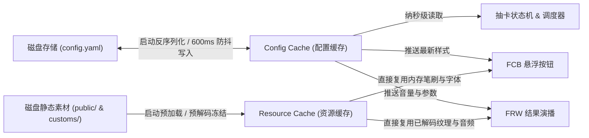
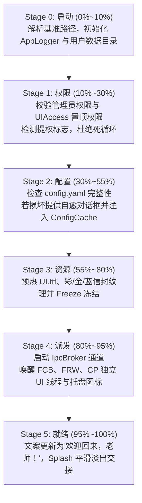
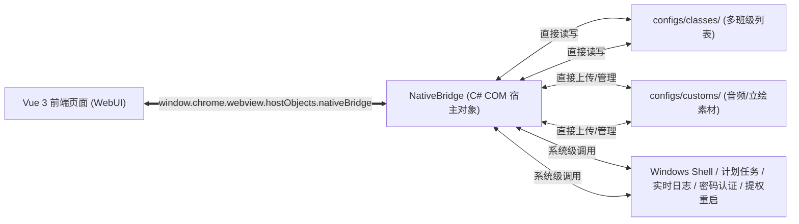

# 蔚蓝点名 (Blue Random) 程序整体架构设计说明书

本文档系统性阐述 **蔚蓝点名 (Blue Random)** 从旧版 Electron 体系重构至 **单一 C# (.NET 10 / WPF) 宿主 + 原生多线程 UI + WebView2 混合前端** 的系统级软件架构、线程拓扑、内存模型、算法引擎与系统级安全机制。

---

## 一、 重构背景与设计哲学

### 1.1 历史背景与痛点
蔚蓝点名初期采用 Electron 框架开发。在长期的运行与多环境桌面适配中，暴露出了如下固有瓶颈：
- **资源开销冗余**：即使只显示一个 60x60px 的桌面小悬浮按钮，Electron 底层也需要启动主进程、多个 Chromium 渲染进程及 GPU 加速进程，常驻内存占用偏大（150MB~300MB）。
- **原生透明窗口与置顶穿透受限**：Chromium 对 Windows `WS_EX_LAYERED` / DirectComposition 异形透明穿透窗口的支持在部分显卡与全屏游戏场景下存在闪烁、黑边、黑屏及被游戏窗口强行遮挡的问题。
- **调度延迟与通信损耗**：Electron 内部基于 Node.js 与 Chromium 之间的 IPC（JSON 序列化与跨进程传输），在结果演播动画呼出时容易出现 200ms~500ms 的冷启动渲染停滞。

### 1.2 新版架构设计哲学
针对上述痛点，新版本确立了四大核心设计原则：
1. **单一宿主进程，多线程原生解耦**：全系统收敛在单一 C# 原生进程内，根绝多进程僵尸驻留与 IPC 跨进程带宽消耗。核心调度与 UI 窗口分布在独立的 STA 线程，UI 渲染完全不卡死核心计算。
2. **零 IO 延迟双重内存缓存**：将运行时频繁访问的配置与美术音频资源提前常驻内存并完成预解码，彻底消除磁盘读取与反序列化开销。
3. **混合前端架构（WebUI as Admin View）**：核心悬浮与演播由 WPF 原生技术栈实现，极致丝滑；配置面板保留基于 Vue 3 + `riz-ui` 的 Web 界面，通过 WebView2 COM 级 `NativeBridge` 直连系统，兼具快速迭代与原生性能。
4. **强健的自愈与提权仲裁机制**：配置损坏一键修复，管理员权限与 UIAccess 提权具备全链路防死循环重启防护。

---

## 二、 进程与线程拓扑模型

全系统运行于单个 C# 宿主进程内，内部划分为四个职责高度独立的执行线程：

```mermaid
flowchart TD
    subgraph HostProcess ["Blue Random C# 单一宿主进程 (Host Process)"]
        Init["启动器流水线 (SplashWindow / StartupPipeline - 0%~100%)"]

        subgraph BackendThread ["线程 1: 后端核心控制与调度线程 (Backend & IPC Thread)"]
            Bus["@IPC 异步无锁通信总线 (Channel<IpcMessage>)"]
            SM["抽卡状态机 (IsDrawing 状态互斥锁)"]
            Engine["纯领域抽卡算法 (LotteryEngine)"]
            CCache["Config Cache (驻留内存唯一生效配置)"]
            RCache["Resource Cache (UI.ttf / 信封纹理 / 音频句柄)"]
            Debounce["防抖落盘持久化器 (Debounce 600ms)"]
        end

        subgraph FCBThread ["线程 2: 悬浮按钮 FCB 独立线程 (STA UI Thread)"]
            FCBWin["WPF 原生透明置顶悬浮窗 (FloatingButtonWindow)"]
            Capsule["1~10 抽动态展开式胶囊选择器"]
            DragLogic["鼠标拖拽捕捉与屏幕边界吸附"]
        end

        subgraph FRWThread ["线程 3: 结果浮窗 FRW 独立线程 (STA UI Thread)"]
            FRWWin["WPF 原生全屏透明置顶演播窗 (ResultWindow)"]
            EnvelopeAnim["信封入场飞入 / 撕开 / 彩光演播 (Storyboard)"]
            CardsGrid["学生卡片动态流式网格渲染"]
            AudioPlayer["MediaPlayer 招募音效与背景音乐同步播放"]
        end

        subgraph CPThread ["线程 4: 配置面板 CP 独立线程 (STA UI Thread)"]
            CPWin["WPF 宿主窗口 (ConfigPanelWindow)"]
            WV2["Microsoft WebView2 运行时 (加载 Vue 3 前端)"]
            Bridge["NativeBridge COM 宿主对象 (直连 classes/ 与 customs/)"]
        end
    end

    Init -->|1. 检查提权 & 防死循环| HostProcess
    Init -->|2. 加载配置注入| CCache
    Init -->|3. 预热核心素材| RCache
    Init -->|4. 初始化总线 & 唤醒线程| Bus
    Init -.->|5. 欢迎后淡出销毁| Init

    FCBWin <-->|@FCB 消息| Bus
    FRWWin <-->|@FRW 消息| Bus
    WV2 <-->|@CP 消息| Bus
    WV2 <==>|HostObject 直连| Bridge
```

### 2.1 线程职责与调度分工

| 线程名称 | 运行时模型 | 调度上下文 | 核心职责 |
| :--- | :--- | :--- | :--- |
| **Backend & IPC 线程** | 后台任务 / 线程池 | `Task` 异步调度 | 运行核心总线消息循环分发；管理加权抽卡算法、并发状态机；维护内存中 Config Cache 与磁盘落盘持久化。 |
| **FCB 悬浮按钮线程** | 原生 WPF UI 线程 | `STAThread` + 独立 `Dispatcher` | 渲染桌面透明圆形悬浮按钮；监听鼠标事件、处理拖拽位置与屏幕边缘吸附；控制 1~10 抽胶囊选择器的展开动画。 |
| **FRW 结果浮窗线程** | 原生 WPF UI 线程 | `STAThread` + 独立 `Dispatcher` | 负责全屏透明招募演播展示；播放信封飞入、拆封粒子光晕与卡片翻转动画；管理音频播放器与 BGM 渐入渐出。 |
| **CP 配置面板线程** | 原生 WPF UI 线程 | `STAThread` + 独立 `Dispatcher` | 承载 WebView2 浏览器控件；渲染 Vue 3 配置页面；挂载 `NativeBridge` 处理多班级与自定义资源文件 IO。 |

> [!NOTE]
> 每一个 UI 线程均拥有自己专属的 STA 消息泵（`Dispatcher.Run()`）。当 WebView2 执行繁重页面解析，或者 FRW 进行大规模动画计算时，FCB 悬浮窗依然保持 60/120 FPS 的极致拖拽丝滑度，互不阻塞。

---

## 三、 双重内存缓存机制 (Dual-Cache Architecture)

为了保证抽卡触发、浮窗弹出与样式更新实现**零磁盘 IO 与零反序列化延迟**，系统在架构底层引入双重内存缓存机制：



### 3.1 Config Cache (配置缓存)
- **定位**：当前系统正在生效的**唯一一份完整运行配置**（包含当前选中的班级学生名单、抽取概率权重、悬浮按钮尺寸/透明度/坐标、结果弹窗参数等）。
- **生命周期与线程安全**：
  - 采用强类型模型 `RootConfig` 承载，封装在 `ConfigCache.Current` 单例中。
  - 通过原子引用替换（Atomic Reference Swap）与内部字段拷贝保障跨线程并发读取一致性。
- **纳秒级就绪查询**：抽卡算法触发时直接从内存访问候选学生集合，不发生任何磁盘读取。
- **防抖落盘持久化 (Debounced Persistence)**：
  - 当悬浮按钮拖拽移动结束时，FCB 发送 `@FCB.PositionChanged`。
  - 后端即时刷新 `ConfigCache` 中的 `(x, y)` 坐标，同时启动 **600ms 定时器防抖**。若 600ms 内未产生新位移，异步将全量配置序列化为带中文注释的标准 YAML 并覆盖磁盘。

### 3.2 Resource Cache (资源缓存)
- **定位**：运行时展示所需的美术、音频及字体句柄集合。
- **预载与优化策略**：
  - **字体缓存**：在应用启动阶段（Stage 3）通过 WPF `FontFamily` 预加载 `public/fonts/UI.ttf`（南西新圆体），界面渲染直接引用内存字体实例。
  - **信封与立绘纹理**：将 `Letter_Rainbow.png`（彩信封）、`Letter_Gold.png`（金信封）、`Letter_Blue.png`（蓝信封）及 `Arona_Plana.png` 预解码为 WPF `BitmapImage` 并执行 `Freeze()` 冻结。冻结后的位图不可修改且天然跨线程安全，可同时供各 STA 线程直接绘制，避免重复解码与显存颠簸。
  - **音效流缓存**：将按钮点击音效 `button_click.wav` 读入内存字节缓冲，点击即可即时触发音频播放。

---

## 四、 纯领域抽卡算法 (Lottery Domain Engine)

加权抽卡引擎 (`LotteryEngine`) 采用纯领域设计，与 UI 表现层完全解耦，提供两种互补的加权抽取模式：

### 4.1 允许重复抽取 (Allow Duplicates)
- **算法模型**：非均匀加权轮盘赌算法（Roulette Wheel Selection）。
- **权重放大机制**：对每位学生的配置权重 $w_i$ 引入非线性指数增强：
  $$w'_i = (w_i)^{1.5}$$
- **抽取逻辑**：计算总累加权重 $W = \sum w'_i$。生成均匀伪随机数 $R \in [0, W)$，通过线性扫描前缀和区间定位选中的学生。每次抽取独立，支持抽取任意次数。

### 4.2 禁止重复抽取 (Without Duplicates)
- **算法模型**：**Efraimidis-Spirakis 加权无放回优先队列采样算法 (Algorithm A-Res)**。
- **采样键值计算**：对池中所有权重 $w_i > 0$ 的学生，取独立随机数 $U_i \sim \text{Uniform}(0, 1)$，计算排序键值：
  $$k_i = -\frac{\ln(U_i)}{w_i}$$
  升序排列 $k_i$，前 $K$ 个最小键值对应的学生即为无放回加权抽样结果。此算法在数学上严格证明了加权无放回概率分布的无偏性。
- **零权重保底补足**：当学生配置权重 $w_i = 0$ 时，将其归入零权重候补池，采用 **Fisher-Yates 原地洗牌算法** 随机打乱，顺序追加填补剩余名额。若总候选人数小于请求抽取人数，则安全返回全量池。

### 4.3 信封等级映射 (Envelope Grade Mapping)
每个抽取的学生对象携带 `letterColor` 属性，引擎自动对应其信封材质：
- `rainbow`：三星最高品质彩信封。
- `gold`：二星进阶品质金信封。
- `blue`：一星基础品质蓝信封。

---

## 五、 原生启动加载器与五阶段原子流水线 (Startup Pipeline)

启动器由轻量级无边框科技感异形窗口 `SplashWindow.xaml` 驱动，采用原子级 5 阶段校验与自愈流水线 (`StartupPipeline`)：



### 5.1 防死循环提权设计
- 启动时解析命令行参数：`--elevatedadmin`（管理员标记）与 `--elevateduia`（UIAccess 标记）。
- 若程序需管理员运行且未提权，携带 `--elevatedadmin` 通过 `runas` 启动新进程并立即终结当前进程。
- 若需 UIAccess，调用 `uiaccess.dll` 内部 API 通过 Windows 特权令牌拉起并附带 `--elevateduia` 退出。
- 启动器检测到已有标记参数时，强制不再二次重试提权，即使提权失败也平滑降级运行，彻底杜绝无限自启死循环。

### 5.2 配置文件自愈机制
- 若 `config.yaml` 格式损坏导致 YAML 反序列化异常，流水线捕获错误，暂停进度条并呈现红色警示态。
- 弹出自愈选择对话框：用户确认后自动恢复出厂默认配置模板并成功启动，避免传统应用直接闪退导致无法使用的窘境。

---

## 六、 原生 UI 组件架构 (1:1 对标 Electron 原版规范)

### 6.1 原生悬浮按钮 (@FCB - Floating Call Button)
- **视觉风格与几何规范**：
  - 纯正扁平二次元动漫风格，绝不使用厚重模糊的投影，主按钮与胶囊保持干净清晰的 2px 蔚蓝描边（`#66CCFF`）。
  - **窗口穿透与无感点击 (Click-Through)**：
    - 宿主窗口尺寸为 240x240px，窗口背景设为 `Background="{x:Null}"`（而非 `Transparent`）。在 WPF 分层窗口中，空笔刷不参与任何命中测试，悬浮球周边的透明区域 100% 穿透至底层桌面/应用程序，绝不误挡用户点击桌面图标；仅有色按钮和胶囊条捕获鼠标。
    - **失焦自闭合**：监听 `Deactivated` 事件，当用户点击桌面其他应用时，若人数选择胶囊处于展开态，自动收起（`TogglePicker(false)`），与原生 Popover 体验完全一致。
  - **动态几何中心锚点 (`UpdateGeometry`)**：
    - 窗口中心严格锚定于 `(120, 120)`。当配置中的 `sizePercent` 改变时，主按钮、左右卫星按钮及顶部胶囊条均通过 `UpdateGeometry` 动态重算绝对坐标，完美适配 50%~150% 任意尺寸缩放，永不错位。
    - **主悬浮按钮**：基准直径 50px 正圆，纯白底色（`#FFFFFF`），内嵌占比 80%（40x40px）的高质量矢量光环抽取图标（`BlueRandom.png`）。鼠标悬停时平滑过渡至深天蓝边框 `rgba(40, 130, 230, 0.9)`。
    - **卫星控制按钮 (Cancel / Confirm)**：严格按照原版 `action-size = 42px` 规范设计，以主按钮中心为原点，左右对称沿 `placement-radius = 55px` 水平排布：
      - **左侧取消 (✕)**：直径 42px，柔粉底色 `#FF9494` + `#FFB0B9` 边框，内嵌白色圆头细十字架矢量路径（`M 18,6 L 6,18 M 6,6 L 18,18`），轻微粉色光晕。
      - **右侧确认 (✓)**：直径 42px，蔚蓝底色 `#66CCFF` + `rgba(166, 233, 255, 0.6)` 边框，内嵌白色圆头细对勾矢量路径（`M 20,6 L 9,17 L 4,12`），轻微天青光晕。
- **1~10 抽动态胶囊选择器 (`PickerCapsule`)**：
  - 严格保持在主按钮上方恰好 **8px 黄金间距**，高度 36px 胶囊全圆角形态（`CornerRadius=18`）。
  - 内部由 `MIN (11px 粗体)`、`细分隔线 (1x16px)`、`− (22px 粗体)`、`细分隔线`、`当前人数徽章 (36x28px, #66CCFF 纯正天蓝底色白字, 0.25s 脉冲弹跳动画)`、`细分隔线`、`+ (20px 粗体)`、`细分隔线`、`MAX (11px 粗体)` 紧密排布。
  - **智能边界保护**：人数为 1 时禁用 `MIN` 与 `−`；人数为 10 时禁用 `MAX` 与 `+`。
  - **展开/收起过渡动效 (`picker-pop`)**：
    - 展开：缩放 `0.85 -> 1.0`，位移 `12px -> 0`，配合 `CubicEase` 用时 0.22 秒。
    - 收起：透明度 `1.0 -> 0` 用时 0.18 秒后折叠。
- **音效联动**：每次点击主按钮、MIN、−、+、MAX、取消或确认，均无延迟播放 `button_click.wav`。
- **拖拽与物理边缘贴合 (`ClampPosition`)**：
  - 鼠标按下移动超过 4px 判定为拖拽意图，启动原生 `DragMove()`。
  - 复刻原版 `clampBoundsToWorkArea` 计算逻辑：允许窗口透明扩展区越出屏幕边界，让视觉核心的圆形按钮无死角贴紧屏幕边缘（`Left` 范围 `workArea.Left - padX` 至 `workArea.Right - Width + padX`）。
  - 拖拽松手即时基于屏幕 `WorkArea` 纠偏，并通过 600ms 防抖静默落盘写入。

### 6.2 原生结果演播浮窗 (@FRW - Floating Result Window)
- **视觉风格与舞台**：
  - 全屏透明置顶覆盖层，背景采用通透全屏层（`#02000000`），点击任意空白区域或按下 `Esc` / `Space` / `Enter` 键平滑淡出关闭。
- **顶部立绘无缝衔接**：
  - 顶部居中放置 `Arona_Plana.png`（宽度 320px），`Margin="0,0,0,-4"` 与主结果面板顶边外框无缝贴合。
- **核心招募主面板 (`MainPanel`)**：
  - 22px 圆角，4px 蔚蓝实线边框（`#66CCFF`），92% 纯白半透底色（`#EBFFFFFF`），`0 8px 32px rgba(6, 22, 48, 0.15)` 柔和弥散阴影。
  - 唤醒时执行 `panel-fly-in` 动画：缩放 `0.85 -> 1.0`，位移 `16px -> 0`，配合 `CubicEase` 缓出，用时 0.7 秒。
- **双排卡片自适应行列网格**：
  - 1~5 抽展示单排（`TopRowPanel`）；6~10 抽自动展开第二排（`BottomRowPanel`，行距 36px，卡片水平间距 28px）。
- **统一 15° 倾斜卡片容器与交错飞入动画 (`letter-fly-in`)**：
  - 每个卡片容器（`cardGrid`，150x112px，4:3 黄金比例）整体统一设置 **15° 倾斜角**（`RotateTransform Angle="15"`）。
  - **交错阶梯下落**：卡片容器按 `index * 120ms` 延迟，从超大倍率（`ScaleX/Y: 2.5 -> 1.0`）、高位偏移（`TranslateY: -24 -> 0`）与透明（`Opacity: 0 -> 1.0`）呼啸而至，重现原汁原味的拆封抽卡演出。
  - 信封铺满容器并享有专属深层柔光投影（`BlurRadius="24", Opacity="0.25"`）。
- **姓名卡弹出动画 (`name-reveal`)**：
  - 位于信封内部的白底圆角卡片（`CornerRadius=10`，深蓝文字 `#1C2741`，内置 UI 字体/粗体）。
  - **完美同轴倾斜**：由于姓名卡置于卡片容器内部，天然跟随信封一同保持 15° 倾斜，彻底消除水平白条贴在斜信封上的割裂感。
  - **分段弹起揭晓**：在所有信封全部下落就位后（`totalDelay = (count - 1) * 120 + 600ms`），姓名卡依次从信封中弹跳浮现（`TranslateY: 12px -> 0`，`Scale: 0.96 -> 1.0`，用时 0.3 秒，时延 `totalDelay + 100ms + index * 120ms`）。
- **防误触锁定 (`_canClose`) 与退场动画**：
  - 动画播放完毕前锁定关闭，防止用户手快误触空白背景中断精彩动画；在 `readyDelay = totalDelay + 450ms` 后方可点击关闭。
  - 退出时执行 `panel-fly-out` 缩放淡出（0.2 秒），窗口平滑隐退后向后端发送 `WindowClosed` 恢复悬浮按钮。
- **底部提示胶囊**：经典天蓝底色白字胶囊条（“点击任意位置关闭”），内置 `CharacterSpacing="200"` 呈现优雅字间距。

---

## 七、 WebView2 混合前端与 NativeBridge 直连架构

### 7.1 前端设计与裁剪
- 配置面板采用成熟的 **Vue 3 + Vite + riz-ui** 方案，兼顾美观性与多标签页复杂表单交互能力。
- **裁剪过时选项**：彻底剔除原有 Electron 架构专用的 Chromium 渲染后端配置（D3D9/Vulkan 切换、DirectComposition 开关、禁用 GPU 软件回退等）。

### 7.2 本地虚拟主机映射 (解决 ES 模块与 CORS 拦截)
- **底层原理**：Vite 构建的前端应用使用 `<script type="module">` 标准。Chromium 将 `file://` 视作 `null` 源，绝对禁止跨源与 ES 模块加载。
- **架构实施**：
  ```csharp
  WebViewControl.CoreWebView2.SetVirtualHostNameToFolderMapping(
      "appassets",
      distDir,
      CoreWebView2HostResourceAccessKind.Allow
  );
  WebViewControl.Source = new Uri("https://appassets/index.html#/config-panel");
  ```
  通过将 `dist/` 映射为标准 `https://appassets/` 虚拟安全源，实现 Vite ES 模块、静态资源与 NativeBridge 的秒开加载与无感通信。

### 7.3 NativeBridge 资产直连机制
不同于抽卡指令需要跨总线协调，多班级数据（`data/classes/`）、自定义资源文件（`data/resources/`）以及系统交互**完全由承载 WebView2 的 C# 宿主通过 `NativeBridge` COM 对象直连处理**：
### 7.3 NativeBridge 资产直连机制与多班级同步
不同于抽卡指令需要跨总线协调，多班级数据（`configs/classes/`）、自定义资源文件（`configs/customs/`）以及系统交互**完全由承载 WebView2 的 C# 宿主通过 `NativeBridge` COM 对象直连处理**：



- **扩展 API 能力清单**：
  - `GetConfigYaml()` / `SaveConfigYaml(yaml)`: 现行配置读取与热生效保存
  - `ListClassesJson()` / `CreateClass(name)` / `RenameClass(...)` / `DeleteClass(...)`: 班级库管理
- **扩展 API 能力清单与协议约定**：
  - `GetConfigYaml()` / `SaveConfigYaml(yaml)`: 现行配置读取与即时热生效保存（同步将名单写入当前激活班级文件）
  - `ListClassesJson()`: 读取所有班级配置并自动回填 `activeClassId`，统一 camelCase 序列化
  - `CreateClass(name)` / `RenameClass(...)` / `DeleteClass(...)`: 班级库 CRUD，自动管理激活班级迁移
  - `SaveCustomResource(...)` / `GetCustomResourceJson(...)` / `DeleteCustomResource(...)`: 素材管理
  - `GetLogsJson(maxLines)`: 将后端文件与控制台日志实时格式化提供给前端“运行日志”标签
  - `GetFloatingPositionJson()`: 实时读取悬浮球屏幕物理坐标同步回填前端
  - `CreateStartupTask(name, path, admin)`: 调用系统 `schtasks.exe` 创建开机启动计划任务
  - `AdminElevate()` / `Restart()` / `OpenDevTools()`: 系统级提权与调试管理

---

## 八、 系统安全性与开机任务调度

1. **管理员开机自启任务**：
   - 避免直接写入注册表 `Run` 键（由于 UAC 限制普通注册表启动无法静默提升管理员权限）。
   - 通过 Windows 任务计划程序（`TaskScheduler`）创建带最高运行特权（`HighestAvailable`）的计划任务，开机登录即由系统静默拉起，不弹出 UAC 提示。
2. **安全凭据认证**：
   - 采用标准 SHA-256 散列存储管理员保护密码（存储于用户目录下的 `.SHA256` 文件）。
   - 密码校验采用常量时间比较算法（`FixedTimeEquals`），杜绝针对密码长度与内容的计时侧信道攻击。

---

## 九、 目录布局、单文件打包与系统托盘

### 9.1 运行时目录拓扑
系统采用绿色便携的近端目录策略，所有配置文件与运行时日志均严格收敛在程序同级的 `configs/` 目录下：
```
BlueRandom/
├── BlueRandom.exe       # C# .NET 10 单文件自包含可执行程序 (含运行时/托管DLL/压缩资源)
├── uiaccess.dll         # 原生 UIAccess 提权注入动态链接库
├── public/              # 静态美术、图标与默认音效素材
├── dist/                # 前端 Vite 预编译生产页面 (提供给 WebView2 载入)
└── configs/             # 运行时动态数据目录 (与 exe 同级)
    ├── config.yaml      # 全局主配置文件
    ├── log.txt          # 运行诊断滚动日志
    └── .SHA256          # 管理员保护密码散列凭据
```

### 9.2 原生系统托盘体系 (TrayService)
- **线程拓扑**：独立于主界面的专属后台 STA UI 线程 (`Tray_UI_Thread`)，杜绝因配置面板或动画加载导致托盘菜单卡顿。
- **Win32 + WPF 双层架构**：
  - 底层基于原生 Win32 `Shell_NotifyIcon` 机制，直接挂载到 Windows 交互桌面系统任务栏通知区，消除了外部第三方库因 GUID 冲突或无窗口消息循环而报 `TryCreate failed` 的缺陷。
  - 左键双击托盘图标即刻瞬时唤醒置顶配置面板。
- **Fluent 蔚蓝档案定制菜单**：
  - 10px 圆角白色卡片，浅灰蓝极细边框，配有 270° 方向的柔和深海蓝深层投影 (`BlurRadius="18", Opacity="0.2"`)。
  - **专属品牌标头**：内嵌 `✨ 蔚蓝点名` 粗体主题蓝标头与 `v2.0 NEXT` 浅青质感徽章。
  - **菜单项与交互动效**：`⚙️ 配置面板 (S)`、`🎯 显示悬浮球 (F)`、`🔄 重启应用 (R)`、`❌ 退出程序 (X)`，鼠标悬停呈现 `#EDF6FF` 浅蓝胶囊高亮与 `#128AFA` 文字主题色。


