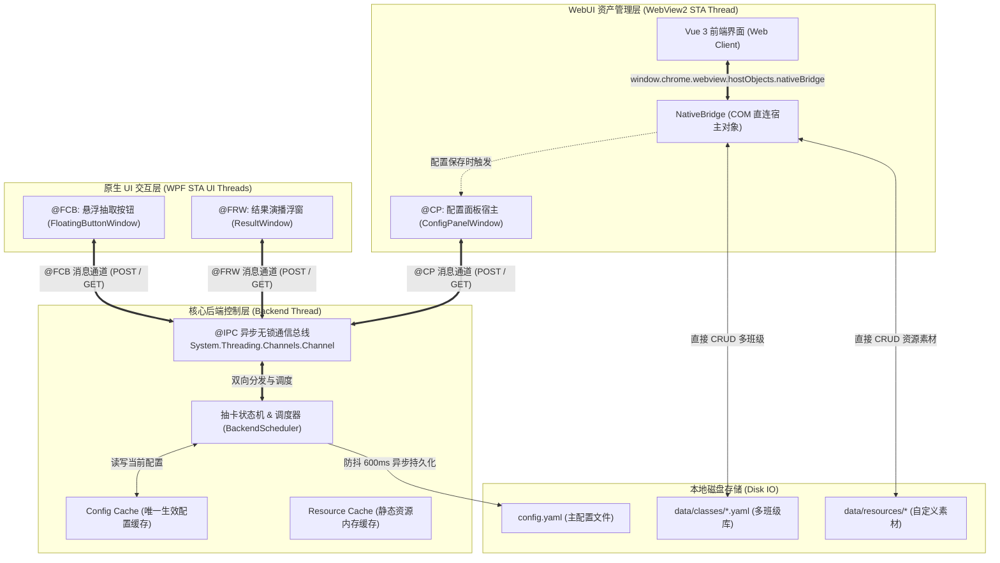
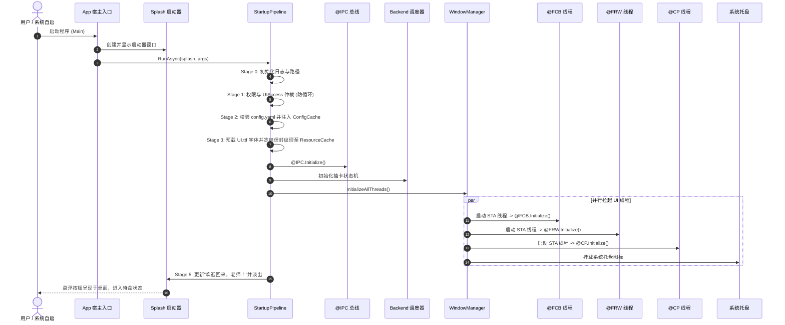
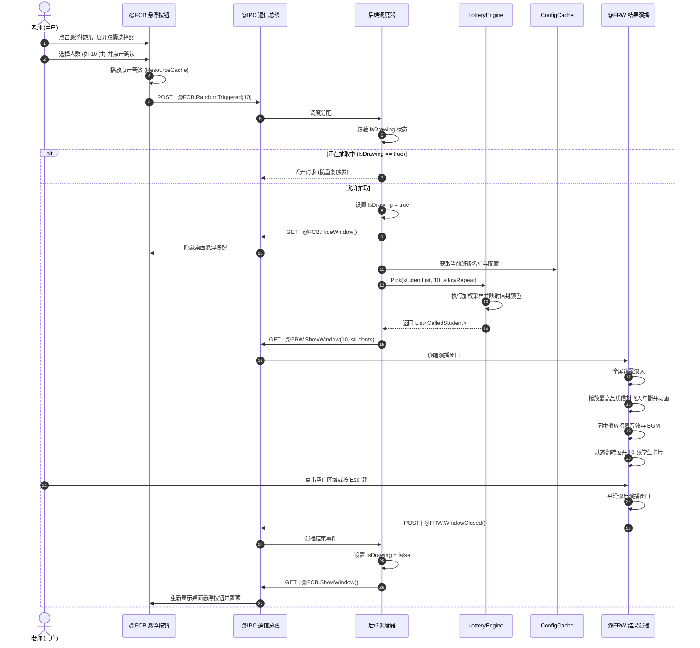
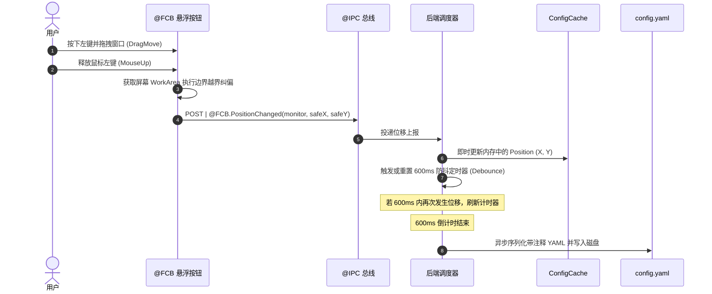
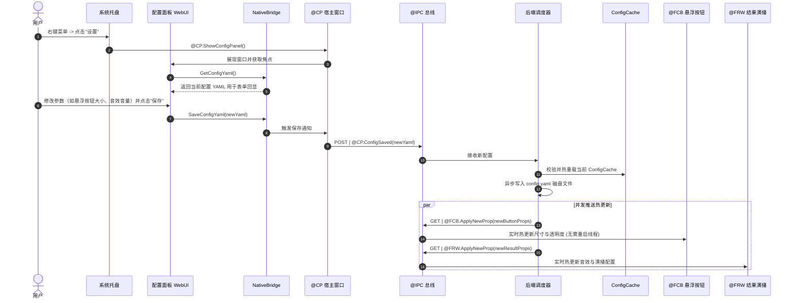
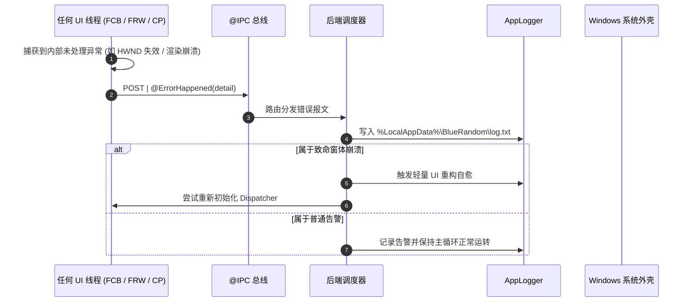

# 蔚蓝点名 (Blue Random) 跨线程通信拓扑与 IPC 协议规范

本文档系统性定义 **蔚蓝点名 (Blue Random)** 进程内通信总线 (@IPC)、各个独立 UI 模块 (@FCB, @FRW, @CP) 的通信拓扑、报文协议规范、动作语义与核心业务全景时序。

---

## 一、 通信拓扑架构总览

在单一 C# 宿主进程模型下，各独立线程之间的协作通过基于 `.NET` 高性能无锁通道的 `@IPC` 通信总线驱动。同时，WebView2 配置面板的庞大文件与资产管理独立解耦至 `NativeBridge` 直连，整体拓扑如下：



---

## 二、 动作语义与通道队列模型

### 2.1 动作语义规范 (Action Semantics)
通信总线中的每一条报文，遵循四种基础动作语义：

| 动作语义 | 符号 | 传递方向 | 设计意图 |
| :--- | :---: | :---: | :--- |
| **INIT** | `INIT` | 启动流水线 $\to$ 组件 | **生命周期-初始化**。下发该组件启动所需的预解析 Props，并唤起其独立 STA 线程消息泵。 |
| **DEST** | `DEST` | 后端 $\to$ 组件 / 全局 | **生命周期-销毁**。安全释放窗口 HWND、销毁渲染表面、注销事件并退出对应 STA 线程。 |
| **GET** | `GET` | 后端 $\to$ 组件 | **主动控制下发**。后端向组件派发控制指令（如显隐窗口、位置重设、热更新外观 Props 等）。 |
| **POST** | `POST` | 组件 $\to$ 后端 | **事件与交互上报**。组件向后端汇报用户动作（拖拽结束、点击抽卡、关闭窗口）或运行时未捕获异常。 |

### 2.2 消息模型定义 (`IpcMessage`)
在 C# 实现中，报文统一抽象为 `IpcMessage` 结构：
```csharp
public sealed class IpcMessage
{
    public string TargetModule { get; init; }   // 目标模块: "FCB", "FRW", "CP", "BACKEND"
    public string ActionType { get; init; }     // 动作语义: "INIT", "DEST", "GET", "POST"
    public string Command { get; init; }        // 指令标识: 如 "RandomTriggered", "PositionChanged"
    public object? Payload { get; init; }       // 强类型参数载荷
    public DateTime Timestamp { get; init; }    // 报文发出时间戳
}
```

### 2.3 底层通道机制 (`System.Threading.Channels`)
- **队列实现**：采用 `Channel.CreateUnbounded<IpcMessage>(new UnboundedChannelOptions { SingleReader = false, SingleWriter = false })`。
- **性能优势**：
  - 基于 CAS 原语的内存无锁环形链表，相比传统 `ConcurrentQueue` 或 `BlockingCollection` 具有极低的 GC 碎片率与纳秒级吞吐量。
  - 天然支持 `ValueTask` 异步等待，在没有报文进入时完全释放 CPU 周期。

---

## 三、 模块协议规范与接口详述

### 3.1 核心通信总线 (@IPC)

#### 1. `INIT | @IPC.Initialize()`
- **参数**：无。
- **功能**：准备跨线程异步通道，启动后台消息调度分发工作线程。

#### 2. `DEST | @IPC.Destroy()`
- **参数**：无。
- **功能**：广播全局终止信号，安全通知各 UI 线程执行 `DEST` 退出，清空双重缓存并安全关闭宿主进程。

---

### 3.2 悬浮抽取按钮模块 (@FCB - Floating Call Button)

#### 1. `INIT | @FCB.Initialize(FCB_props, monitor_number, position_x, position_y)`
- **载荷参数**：
  - `FCB_props` (`FloatingButtonConfig`)：从 Config Cache 提取的预解析按钮属性（尺寸百分比、透明度、边框色、图标大小等）。
  - `monitor_number` (`int`)：停靠的目标屏幕索引。
  - `position_x` (`double?`)：初始 X 屏幕绝对坐标。
  - `position_y` (`double?`)：初始 Y 屏幕绝对坐标。
- **功能**：启动 FCB 原生 STA 线程，创建半透明置顶窗口，定位至安全坐标并开始渲染。

#### 2. `DEST | @FCB.Destroy()`
- **参数**：无。
- **功能**：关闭悬浮窗，注销系统事件监听，安全终止 FCB 线程。

#### 3. `POST | @FCB.PositionChanged(monitor_number, position_x, position_y)`
- **载荷参数**：
  - `monitor_number` (`int`)：当前吸附屏幕索引。
  - `position_x` (`double`)：拖拽松手后的纠偏 X 坐标。
  - `position_y` (`double`)：拖拽松手后的纠偏 Y 坐标。
- **功能**：用户拖拽悬浮窗松手后即时上报。后端立即同步更新 `ConfigCache` 中的坐标数据，并激活 **600ms 防抖定时器** 异步写入磁盘。

#### 4. `POST | @FCB.RandomTriggered(call_amount)`
- **载荷参数**：
  - `call_amount` (`int`)：本次请求抽取人数（1 ~ 10）。
- **功能**：用户点击悬浮窗选择器触发抽取。后端状态机拦截请求，若当前正在抽取中（`IsDrawing == true`）则安全忽略；否则进入抽卡状态。

#### 5. `POST | @FCB.WindowOverlaid()`
- **参数**：无。
- **功能**：悬浮窗被全屏应用或其他顶层窗口遮挡时上报。后端调度调用 Win32 `BringWindowToTop` 与 `SetWindowPos`（`HWND_TOPMOST`）执行置顶刷新。

#### 6. `POST | @FCB.ErrorHappened(detail)`
- **载荷参数**：
  - `detail` (`string`)：异常堆栈或错误描述。
- **功能**：FCB 线程内未捕获异常上报，写入统一日志。

#### 7. `GET | @FCB.HideWindow()`
- **参数**：无。
- **功能**：后端通知 FCB 隐藏窗口（例如 FRW 正在全屏演播抽卡动画时，避免悬浮窗遮挡演播画面）。

#### 8. `GET | @FCB.ShowWindow()`
- **参数**：无。
- **功能**：后端通知 FCB 重新显示并恢复置顶。

#### 9. `GET | @FCB.ApplyNewProp(FCB_props)`
- **载荷参数**：
  - `FCB_props` (`FloatingButtonConfig`)：最新的悬浮按钮外观配置。
- **功能**：热更新悬浮按钮尺寸、透明度、边框颜色或图标，无需重启线程。

#### 10. `GET | @FCB.MoveNewPosition(monitor_number, position_x, position_y)`
- **载荷参数**：
  - `monitor_number` (`int`)：目标屏幕索引。
  - `position_x` (`double`)：目标 X 坐标。
  - `position_y` (`double`)：目标 Y 坐标。
- **功能**：后端主动纠偏或重设悬浮按钮屏幕位置。

---

### 3.3 结果浮窗模块 (@FRW - Floating Result Window)

#### 1. `INIT | @FRW.Initialize(FRW_props)`
- **载荷参数**：
  - `FRW_props` (`PickResultDialogConfig`)：结果演播浮窗配置（音量、背景音乐开关、透明度等）。
- **功能**：启动 FRW 独立 STA 线程，预热全屏透明窗口表面，从 Resource Cache 绑定已预解码的信封材质。

#### 2. `DEST | @FRW.Destroy()`
- **参数**：无。
- **功能**：停止音频播放，释放渲染上下文，安全终止 FRW 线程。

#### 3. `GET | @FRW.ShowWindow(amount, called_student)`
- **载荷参数**：
  - `amount` (`int`)：本次抽取总人数。
  - `called_student` (`List<CalledStudent>`)：抽卡计算结果列表（学生姓名、对应的信封品质颜色 `rainbow` / `gold` / `blue`）。
- **功能**：后端抽卡算法完成计算后下发此指令。FRW 立即淡入全屏遮罩，播放信封飞入、撕封动效并逐张展开卡片。

#### 4. `GET | @FRW.CloseWindow()`
- **参数**：无。
- **功能**：后端主动指令平滑关闭/淡出结果演播窗。

#### 5. `GET | @FRW.ApplyNewProp(FRW_props)`
- **载荷参数**：
  - `FRW_props` (`PickResultDialogConfig`)：最新演播参数。
- **功能**：热更新音量、音效或半透明背景配置。

#### 6. `POST | @FRW.WindowClosed()`
- **参数**：无。
- **功能**：用户点击演播窗空白区域或按 `Esc` 键退出演播时上报。后端将 `IsDrawing` 标志位置为 `false`，并下发 `@FCB.ShowWindow()` 唤醒桌面悬浮按钮。

#### 7. `POST | @FRW.ErrorHappened(detail)`
- **载荷参数**：
  - `detail` (`string`)：异常详情。
- **功能**：演播线程异常上报。

---

### 3.4 配置面板模块 (@CP - ConfigPanel WebUI)

#### 1. `INIT | @CP.Initialize()`
- **参数**：无。
- **功能**：启动 CP 独立 STA 线程，创建宿主窗口并预热 WebView2 运行时，加载本地构建产物 `dist/index.html`。

#### 2. `DEST | @CP.Destroy()`
- **参数**：无。
- **功能**：注销 WebView2 宿主环境，关闭窗口并终止 CP 线程。

#### 3. `GET | @CP.ShowConfigPanel()`
- **参数**：无。
- **功能**：唤醒配置窗口（用户点击系统托盘菜单“设置”时触发），将窗口从后台隐藏状态还原至前台并赋予焦点。

#### 4. `GET | @CP.FetchConfig(ConfigYaml)`
- **载荷参数**：
  - `ConfigYaml` (`string`)：当前后端生效的完整运行配置 YAML 文本。
- **功能**：主动从 Config Cache 导出最新 YAML 文本并推送到前端，用于表单数据回显。

#### 5. `GET | @CP.OverwriteConfig(ConfigYaml)`
- **载荷参数**：
  - `ConfigYaml` (`string`)：覆盖配置文本。
- **功能**：后端强制同步最新配置至前端界面表单树。

#### 6. `POST | @CP.ConfigSaved(ConfigYaml)`
- **载荷参数**：
  - `ConfigYaml` (`string`)：用户点击保存时提交的完整配置 YAML 文本。
- **功能**：后端验证 YAML 结构，更新 `ConfigCache`，异步写入 `config.yaml`，并向 FCB、FRW 广播热更新 `ApplyNewProp` 指令。

#### 7. `POST | @CP.ErrorHappened(detail)`
- **载荷参数**：
  - `detail` (`string`)：异常详情。
- **功能**：WebView2 渲染错误上报。

---

## 四、 NativeBridge 直连架构与隔离边界

配置面板前端通过 `window.chrome.webview.hostObjects.nativeBridge` 直接与宿主 C# COM 对象通信。**该链路完全不经过核心 IPC 通信总线**，其接口定义如下：

```csharp
[ComVisible(true)]
public class NativeBridge
{
    // 1. 配置交互
    public string GetConfigYaml();
    public bool SaveConfigYaml(string yaml);
    public void ResetConfig();

    // 2. 班级管理直连 (data/classes/ 增删查改)
    public string ListClassesJson();
    public string CreateClass(string name);
    public bool RenameClass(string classId, string newName);
    public bool DeleteClass(string classId);
    public string LoadClassJson(string classId);
    public bool SaveClassJson(string json);

    // 3. 自定义素材直连 (customs/)
    public string SaveCustomResource(string fileName, string mimeType, string purpose, string base64, double duration);
    public string GetCustomResourceJson(string customId);
    public bool DeleteCustomResource(string customId);
    public string GetCustomDataUrl(string customId);

    // 4. 系统与文件操作
    public string PickFile(string filter);
    public void OpenConfigFolder();
    public void OpenUrl(string url);
    public void ClearCache();
    public string GetAppInfoJson();
    public bool CreateStartupTask(string taskName, string exePath, bool asAdmin);

    // 5. 窗口、调试与日志
    public void CloseWindow();
    public void OpenDevTools();
    public void Restart();
    public void AdminElevate();
    public string GetFloatingPositionJson();
    public string GetLogsJson(int maxLines);
    public void Log(string level, string message);

    // 6. 安全管理 (.SHA256)
    public bool IsSecurityEnabled();
    public bool VerifyPassword(string pwd);
    public bool SetPassword(string pwd);
    public bool DisablePassword(string pwd);
    public bool ResetAllConfig();
}
```

### 4.1 序列化协议与桥接适配层规范 (Bridge Protocol Contract)

为彻底消灭前后端数据交互中常见的字段大小写失配与传参结构异构问题，架构制定了严格的契约：

1. **统一 camelCase 序列化与原生中文输出**：
   - C# 端所有模型 (`StudentItem`, `ClassConfig`, `CustomResourceItem`) 显式标注 `[JsonPropertyName("...")]` 与 `[YamlMember(Alias = "...")]`。
   - `NativeBridge` 序列化统一装配 `JsonSerializerOptions`：
     - `PropertyNamingPolicy = JsonNamingPolicy.CamelCase`
     - `PropertyNameCaseInsensitive = true`
     - `Encoder = JavaScriptEncoder.UnsafeRelaxedJsonEscaping`（避免中文字符转义为 `\uXXXX`）。
2. **前端适配层双向参数弹性容错 (Dual-Parameter Resilience)**：
   - `nativeBridgeAdapter.js` 对所有班级管理 (`createClass`, `renameClass`, `deleteClass`)、自定义素材 (`getCustom`, `deleteCustom`) 及安全凭据 (`setPassword`, `verifyPassword`) 进行入参重载兼容，同时支持**标量值直传**（如 `createClass("三年二班")`）与**解构对象传参**（如 `createClass({ name: "三年二班" })`）。
   - 返回值结构统一为标准 `{ ok: boolean, message?: string, ... }` 响应规范，杜绝 `true.ok === undefined` 导致的假失败。
3. **配置保存即时双向同步 (Synchronous Config & Class Roster Sync)**：
   - 前端触发 `saveConfig(payload)` 时，`NativeBridge.SaveConfigYaml` 同步调用 `BackendScheduler.SaveAndApplyConfig(yaml)`。
   - 不仅持久化 `configs/config.yaml`，还将最新的名单数据 (`StudentList`) 同步回写入当前激活班级的文件 `configs/classes/classes_<id>.yaml`，确保切班与刷新即刻读取最新数据。

> [!IMPORTANT]
> **隔离收益**：
> 1. 核心总线只负责轻量级的控制流（显隐、抽卡指令、样式热更）。
> 2. 班级列表切换、文件流上传、日志拉取等大数据操作在 NativeBridge 内直接处理，保护抽卡调度线程的高性能。
> 3. 前端加载由 `SetVirtualHostNameToFolderMapping("appassets", ...)` 提供安全源 `https://appassets/index.html#/config-panel`，从根源规避了 Chromium 在 `file://` 协议下拦截 ES 模块与 CORS 的问题。

---

## 五、 核心业务全景时序图 (Sequence Diagrams)

### 5.1 应用启动与全线程就绪时序



---

### 5.2 抽卡抽取与演播全生命周期时序



---

### 5.3 悬浮窗拖拽与防抖落盘时序



---

### 5.4 配置面板热更新同步时序



---

### 5.5 异常捕获与调度自愈时序



